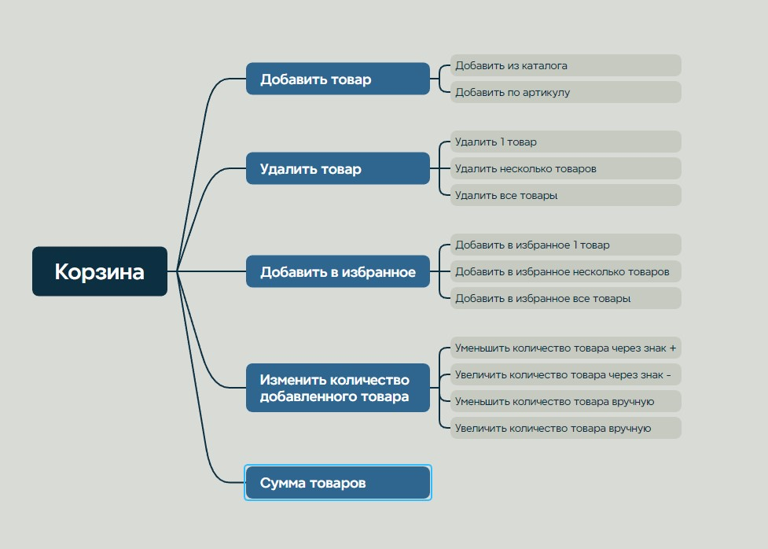

# 📝 Тест-план — Sima-Land

## 📌 О проекте

**Объект тестирования:** функциональность «Корзина» маркетплейса Sima-Land.

Учебная работа выполнена в рамках изучения основ тестирования программного обеспечения.

В рамках задания были подготовлены:

- тест-план;
- майнд-карта функциональности;
- декомпозиция функциональности до отдельных действий;
- подбор техник тест-дизайна для проверки функциональности корзины.

---

## 🎯 Объект тестирования

Функциональность корзины:

- добавление товара;
- удаление товара;
- добавление товара в избранное;
- изменение количества товара;
- проверка суммы товаров.

---

## 🧠 Использованные техники тестирования

В зависимости от проверяемой функциональности применялись:

- классы эквивалентности и граничные значения;
- таблица состояний и переходов;
- таблица решений;
- попарное тестирование;
- сессионное тестирование;
- тест-туры;
- предугадывание ошибок.

---

## 🌐 Тестовое окружение

Для кросс-браузерной проверки рассматривались:

- Google Chrome
- Яндекс Браузер
- Opera
- Mozilla Firefox
- Microsoft Edge
- Safari

---

## 🗺 Майнд-карта

---

## 📎 Артефакты

- 📋 [Открыть тест-план](./test-plan-sima-land.pdf)
- 🗺 [Открыть майнд-карту в полном размере](./mind-map.jpg)

- 🗺 Майнд-карта функциональности
- 📋 Тест-план
